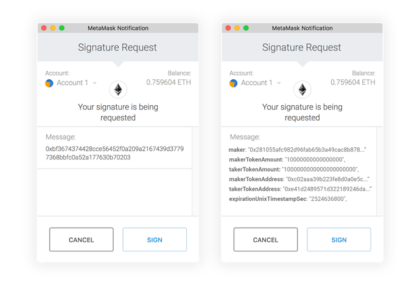

# Wallet API - Web App connection design

## Vision

Assumptions:

1) We want to support static-server single-page web-apps: SPA Web Apps, that can be served from IPFS or siasky. Also we want to preserve the SPA state (avoid  navigating out of the site), that's why this is a chrome/chromium extension wallet.

2) Our "model-user" is not an expert. Our user doesn't want to have to acquire deep knowledge of the underlying technologies to use the application.
For example, even if EIP712 is a huge improvement, in the eyes of our hypothetical user, the before and after of EIP721 are unreadable

 *([EIP712 "before and after"](https://ethereum-magicians.org/t/eip-712-eth-signtypeddata-as-a-standard-for-machine-verifiable-and-human-readable-typed-data-signing/397). To read/understand/verify the data in the image on the right, you need way more knowledge our model-users have, so both screens are unreadable to them. Amounts with that many zeroes are confusing and hard to read and they don't know what to do with a unix timestamp. Our users are not necessarilly experts)*

3) This is what we want our users to see when approving transactions:

 *example from DApp-diversifying-staking-pool & narwallet*
  The info here for the user is: what application is currently connected, what contract the user is going to operate on and what function exactly is going to call, with all the amounts in $unc (no yoctos, all easy to read amounts), and finally what account is connected and will sign the transaction.

4) We want to ease-up the onboarding of ethereum users. One of the Utility features more alien to eth users is the fact that an account can have *more than one private key*. We're hiding that functionality. In normal operations, we're asking for the seed phrase or a priv-key (full access) and then sign transactions with that, i.e. the wallet is not adding keys to the user's near account.
