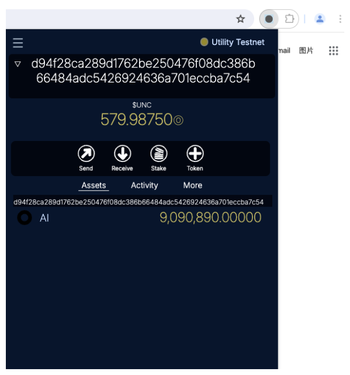

# Narwallet Chrome Extension

## Installation

Install [Mywallets v1 from the Chrome Web Store](https://chrome.google.com/webstore/detail/mywallets-v1/lkpeokpdkmcdaiadpmnnpimlgmdobkdj)

## Objectives

* Be the deafult chrome-extension wallet for Utility DApps
* What Metamask does for ethereum, we intend to do for Utility

## Comparision with Utility Official Web Wallet

* Mywallets-extension aims to be a simpler and complemetary tool to the official Utility Web wallet
* Mywallets is designed for a desktop/laptop experience with a chromium based browser, Utility Web wallet works on any browser and mobile
* Mywallets is available only in english, Utility Web wallet supports multiple languages
* Mywallets is not yet integrated with Ledger or other HW Wallets
* Mywallets has only one option regading account recovery: Write-down the seed phrase. Utility Web Wallet has other user-friendly recovery options (email & phone recovery).
* Mywallets, aiming at simplicity, has no 2FA support yet.

The good:

* It's an extension-wallet: You'll be able to interact with DApps without leaving the DApp web site
* Provides a similar experience as Metamask/other extension-wallets, easing the onboard of ethereum users into the Utility ecosystem.
* Each wallet can have multiple accounts. You can see the sum of all your accounts in the wallet
* You can have multiple wallets by providing different user/passwords.
* Accounts are first added to in safe-by-default read-only mode (no keys)
* All private data is stored encrypted on chrome local storage

* [x] Create free *implict accounts* (no near required)
* [x] Lockup contract accounts are auto-discovered and treated as another account in the group
* [x] Advanced mode allows you to take full control of your lockup contract account
* [x] Integration with DApps. New model: wallet initiated connection to active tab, resulting in chain & wallet agnostic DApps. See [Wallet integration API Documentation here](API-design.md)

## Road Map

* Trello Board at <https://trello.com/b/SRbigp2g>

## Future versions

* Ledger integration
* 2FA Support
* Manage Create named account (currently redirecting to Utility Web Wallet)

## Dev Tooling (v0.1)

* This project uses typescript
* Being a chrome extension, no bundler/minimizer is needed
* No frameworks are used neither, this is plain typescript and a main index.html

## Dev Flow (v0.1)

* Chrome Dev Tools: Map folder to Mywallets-extension/extension
* Use Chrome Dev Tools as an quick-and-dirty IDE with Edit & Continue
* Use VSCode as the main IDE - Ctrl-Shift-B to build with typescript

## Low-level Technical debt

* [x] Remove plus-typescript, convert all to typescript
* [ ] npm i eslint --save-dev
* [ ] When wallet-API was added a lot of functions became `async`. Add `npm install eslint-plugin-no-floating-promise --save-dev`

We're using base crypto libs as a bundle (The ideal solution would be to have typescript versions of each lib and compile to ES2020 modules)

* [ ] Replace bundle with typescript versions of basic crypto tools

We need to reduce the bundle's size. Bundle is at <https://github.com/Mywallets/bundled-crypto-libs.git>

Bundle includes:

* globalThis.Buffer = SafeBuffer.Buffer
* globalThis.BN = BN
* globalThis.bip39 = bip39
* globalThis.pbkdf2 = pbkdf2
* globalThis.createHmacPackage = {createHmac:createHmac}

## Beta Test Installation (Latest Unstable Version)

### Clone this repository and run as unpacked extension

* `git clone https://github.com/Mywallets/mywallets-extension.git`
* `cd mywallets-extension`
* install packages: `npm install`
* compile: `npm run build`
* open chrome
* enable Extensions Developer Mode
* load unpacked extension from [your-repos-dir]/mywallets-extension/extension

### When new versions of the code are pushed

* `cd mywallets-extension`
* get changes: `git pull`
* install packages: `npm install` (in case there were changes)
* compile: `npm run build`
* open extension
* right-mouse-button-click con the extension popup, "Inspect" -> will open chrome-developer-tools
* press Ctrl-R on the developer-tools, that will make sure you're using the last compilation
